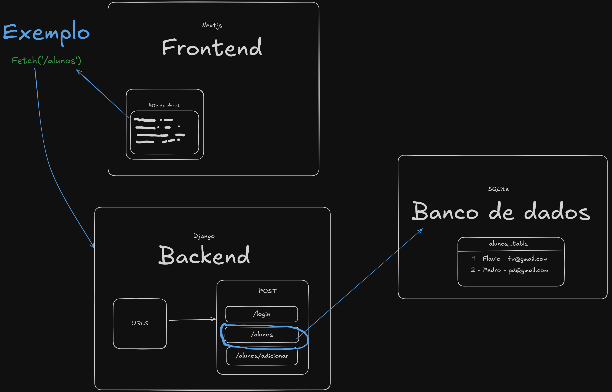

# Projeto CRUD - Uninassau

## Projeto


## Brainstorm / Fluxograma



## Estrutura do Projeto

O projeto está dividido em duas partes principais:

1. **Back-End**: Localizado na pasta `projeto-crud-uninassau/back-end`.
2. **Front-End**: Localizado na pasta `projeto-crud-uninassau/front-end`.

---

## Back-End

### Comandos de Instalação

Execute os seguintes comandos para instalar as dependências do back-end:

```
pip install django
pip install djangorestframework
pip install django-cors-headers
```

### Iniciando o Servidor

Para iniciar o servidor, utilize o comando:

```
python3 manage.py runserver 8000
```

### Resolução de Erros com Tabelas

Caso ocorra algum erro relacionado a tabelas:

1. Delete o arquivo `db.sqlite3`.
2. Execute o comando:

```
python3 manage.py migrate
```

3. Inicie o servidor novamente:

```
python3 manage.py runserver 8000
```

**Nota:** Não finalize o script enquanto o servidor estiver rodando, caso contrário a aplicação será interrompida.

---

## Front-End

### Comandos de Instalação

Na pasta `projeto-crud-uninassau/front-end`, execute o seguinte comando para instalar as dependências:

```
npm install
```

### Iniciando o Servidor

Para iniciar o servidor do front-end, utilize:

```
npm run dev
```

**Nota:** Não finalize o script enquanto o servidor estiver rodando, caso contrário a aplicação será interrompida.

---

## Rotas do Back-End

As rotas disponíveis no back-end estão definidas como segue:

```python
from django.urls import path
from . import views

urlpatterns = [
    path('login',                   views.login,           name='api-login'),
    path('logout',                  views.logout,          name='api-logout'),
    path('alunos',                  views.listar_alunos,   name='listar-alunos'),
    path('alunos/adicionar',        views.adicionar_aluno, name='adicionar-aluno'),
    path('alunos/<int:id>get/',     views.get_aluno,       name='get-aluno'),
    path('alunos/<int:id>/editar',  views.editar_aluno,    name='editar-aluno'),
    path('alunos/<int:id>/excluir', views.excluir_aluno,   name='excluir-aluno'),
]
```

---

## Observações

- Certifique-se de que as dependências estão instaladas corretamente antes de iniciar os servidores.
- Utilize as rotas para realizar operações CRUD no back-end.